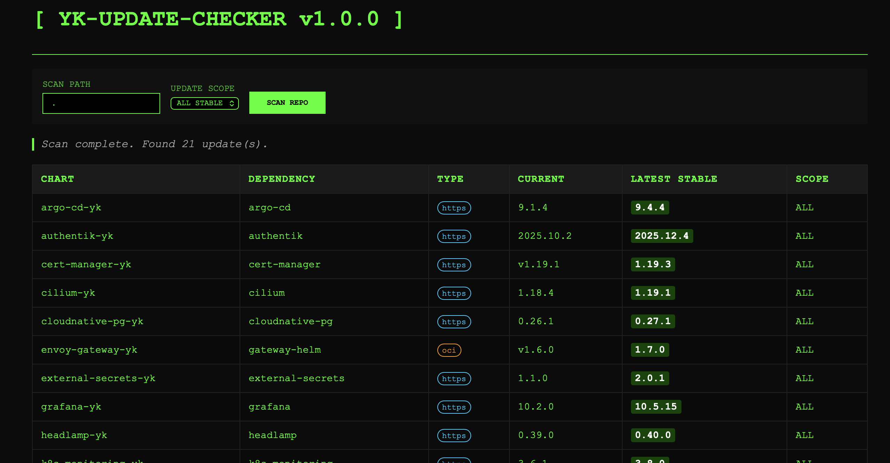

# yk-update-checker



A modern Go application designed to scan GitHub repositories for Helm charts and check for dependency updates across HTTPS and OCI repositories.
 It features a sleek terminal-themed web interface and built-in Prometheus metrics for infrastructure monitoring.

## 🚀 Features

- **Dual Mode**: Use as a one-off CLI tool or a persistent Web Server.
- **Terminal UI**: A high-contrast, interactive web dashboard with real-time scanning.
- **Dependency Scanning**:
  - Supports **Classic HTTPS** Helm repositories.
  - Supports **OCI-based** registries.
  - Scoped updates: Choose between `patch`, `minor`, `major`, or `all` stable updates.
- **Observability**: Built-in Prometheus `/metrics` endpoint for Grafana integration.
- **Performance**: Concurrent update checking with configurable worker pools.
- **Portable**: Single binary with all static assets (HTML, Favicon) embedded via `go:embed`.

## 🛠 Prerequisites

- **Go 1.25+**
- **Git** command-line tool installed and in your system `PATH`.

## 📦 Installation & Build

The project uses a `Makefile` for standard development tasks:

```bash
# Build the binary with version injection
make build

# Run unit tests
make test

# Clean build artifacts
make clean
```

## 🖥 Usage

### Web Mode (Recommended)
Start the web server to access the dashboard:

```bash
# Start with default settings
./yk-update-checker -web

# Start locked to a specific repository
./yk-update-checker -web -repo https://github.com/my-org/charts-repo
```
Open `http://localhost:8080` in your browser.

### CLI Mode
Perform a quick scan directly from your terminal:

```bash
./yk-update-checker -repo https://github.com/helm/examples -path charts -update-type minor
```

### Options
- `-web`: Start in web server mode.
- `-repo`: GitHub repository URL to scan.
- `-path`: Path within the repository to scan (defaults to `.`).
- `-port`: Port for the web server (defaults to `8080`).
- `-update-type`: Scope of updates to find: `all`, `major`, `minor`, `patch`.
- `-verbose`: Enable debug logging.

## 📊 Monitoring

The application exposes Prometheus metrics at `/metrics`. 

**Key Metrics:**
- `helm_update_checker_updates_available`: Gauge listing found updates with labels for chart and version.
- `helm_update_checker_scans_total`: Counter for total scans executed.
- `helm_update_checker_scan_duration_seconds`: Histogram of scan performance.

See `todo/grafana.md` for dashboard planning.

## 🏗 Project Structure

- `cmd/yk-update-checker/`: Main entry point and CLI logic.
- `internal/api/`: Request handlers for UI and JSON API.
- `internal/server/`: HTTP server configuration and static asset embedding.
- `internal/helm/`: Helm chart discovery and version checking logic.
- `internal/github/`: Git repository interaction.
- `internal/metrics/`: Prometheus metric definitions.
- `internal/version/`: Build-time version information.
- `docs/`: Detailed documentation (Architecture, etc.).

## 📜 Documentation

- [Architecture Overview](docs/architecture.md)
- [Command Line Flags](docs/flags.md)
- [Docker Usage](docs/docker.md)

## 🗺️ Roadmap

See the [ROADMAP.md](ROADMAP.md) for planned features and future development goals.
